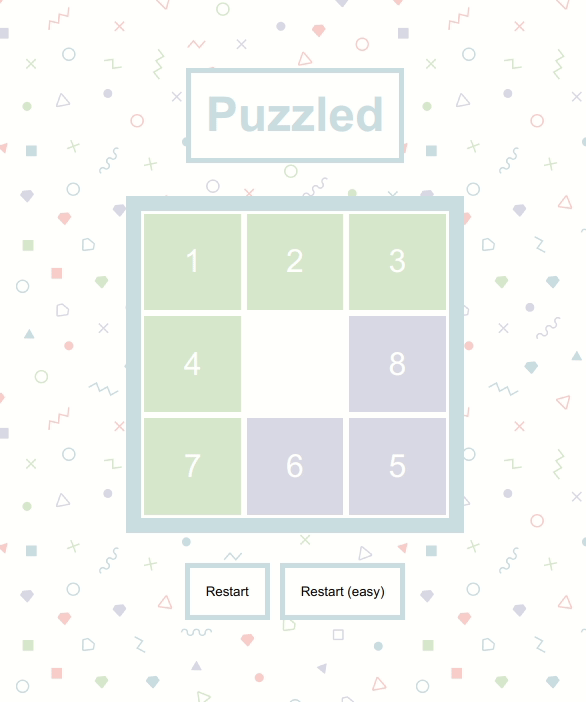

# Code challenge for Puzzle 15

> You can find a live version of this project at: [https://cyrilf.github.io/puzzled](https://cyrilf.github.io/puzzled)

----

[A puzzle 15](https://en.wikipedia.org/wiki/15_puzzle) is a sliding puzzle where the goal is to order all the pieces in an ascending order.

----

## Setup

`git clone https://cyrilf.github.io/puzzled && cd puzzled`

`npm i && npm run start`

## Build

In order to build and deploy a new version you can simply run:

`npm run deploy`

----

## Improvements

- [ ] Add tests
- [ ] Use SASS (or styled components)
- [ ] Allow the user to choose the size of the grid
- [ ] Fix the hard-coded `33.333%` in the css to define a Cell size
- [ ] Add a timer
